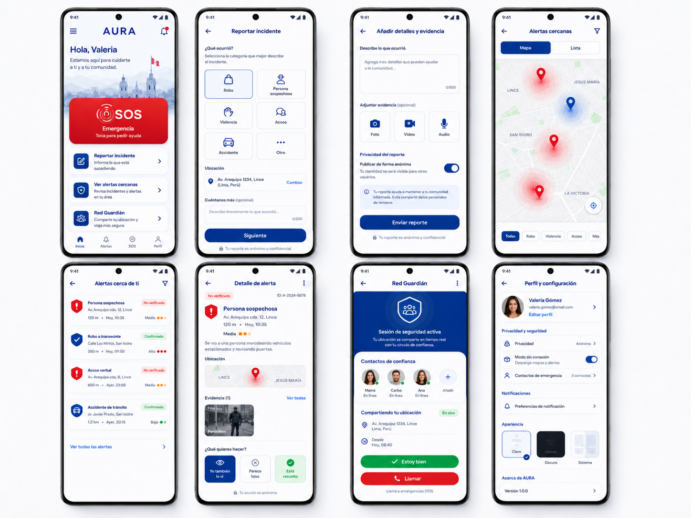

# 🛡️ AURA

**Seguridad ciudadana inteligente, comunitaria y privada para Perú.**

AURA es una aplicación móvil **open source para Android**, desarrollada en **Kotlin**, que permite a ciudadanos reportar incidentes, recibir alertas cercanas y activar un modo de emergencia privado con contactos de confianza.

El MVP 0.1 se enfoca en tres flujos principales:

1. **Reportar incidentes**
2. **Ver alertas cercanas**
3. **Activar Red Guardián / SOS**

AURA propone una capa colaborativa de seguridad ciudadana que permita reportar incidentes, alertar a la comunidad y coordinar respuestas locales.

---

## Visión

En muchas ciudades del Perú, la inseguridad se vive de forma fragmentada: grupos de WhatsApp, publicaciones en redes sociales, rumores vecinales, reportes informales y poca trazabilidad.

AURA propone una infraestructura móvil, simple y verificable para que las comunidades puedan:

* Reportar incidentes de forma rápida.
* Recibir alertas relevantes por ubicación.
* Compartir ubicación con contactos de confianza en situaciones de riesgo.
* Guardar evidencia localmente.
* Funcionar parcialmente sin conexión.
* Reducir falsas alarmas mediante verificación comunitaria.
* Preservar la privacidad del usuario.

---

## Estado del proyecto

```txt
Versión: MVP 0.1
Plataforma: Android
Lenguaje: Kotlin
Estado: Diseño inicial / prototipo funcional
Licencia: MIT
```

---

## Desarrollo Android

```bash
./gradlew :app:assembleDebug
```

El proyecto usa Kotlin, Jetpack Compose, Material 3, Gradle Kotlin DSL y el paquete base `io.aura.android`.

### Configuracion del servidor

Para Supabase, agrega estas variables a `.env.local` en la raiz del proyecto
(el archivo esta ignorado por Git):

```properties
SUPABASE_URL=https://TU_PROJECT_REF.supabase.co
SUPABASE_PUBLISHABLE_KEY=TU_PUBLISHABLE_KEY
```

Tambien se pueden definir como variables de entorno del sistema. Usa
la clave publishable (o la `anon` legacy) en Android; nunca incluyas la clave
`service_role` en la aplicacion.

La app lee la URL base del API desde `BuildConfig.AURA_API_BASE_URL`.

```bash
# Backend local para emulador Android
./gradlew :app:assembleDebug

# Backend local personalizado
./gradlew :app:assembleDebug -PAURA_DEBUG_API_BASE_URL=http://10.0.2.2:8080/

# Backend de produccion para builds release
./gradlew :app:assembleRelease -PAURA_PRODUCTION_API_BASE_URL=https://api.example.com/
```

Si no se define una propiedad, `debug` usa `http://10.0.2.2:8080/` y `release` usa `https://api.aura.community/`.

---

## Objetivo del MVP 0.1

El objetivo del MVP 0.1 es validar si una app ciudadana puede ayudar a comunidades locales a reportar, visualizar y reaccionar ante incidentes de seguridad de forma rápida, útil y responsable.

El MVP no busca reemplazar a la Policía Nacional, serenazgo, bomberos, líneas de emergencia ni autoridades competentes. AURA funciona como una herramienta comunitaria de alerta, documentación y coordinación.

---

### Generación automática de denuncias con LLM

AURA contempla una funcionalidad de **generación automática de denuncias con LLM**, donde los reportes ciudadanos, evidencia adjunta, ubicación aproximada, fecha, hora y descripción del incidente puedan convertirse en un borrador estructurado de denuncia o reporte formal. Este documento sería generado por inteligencia artificial en lenguaje claro, ordenado y compatible con formatos institucionales, pero siempre quedaría sujeto a revisión, edición y aprobación explícita del usuario antes de ser exportado, compartido o presentado ante una autoridad. La app no reemplaza asesoría legal ni canales oficiales de denuncia; su objetivo es ayudar al ciudadano a organizar mejor la información, reducir fricción al documentar incidentes y preservar trazabilidad básica de los hechos.


## Funcionalidades principales

### 1. Reportar incidente

El usuario puede reportar rápidamente un incidente cercano.

Tipos iniciales de incidente:

* Robo
* Intento de robo
* Persona sospechosa
* Violencia
* Acoso
* Accidente
* Zona peligrosa
* Otro

El flujo permite seleccionar:

* Tipo de incidente
* Nivel de gravedad
* Ubicación aproximada
* Descripción opcional
* Evidencia opcional: foto, video o audio
* Modo de privacidad

Estados posibles del reporte:

```txt
draft
pending_sync
submitted
under_review
community_confirmed
authority_confirmed
resolved
dismissed
```

---

### 2. Alertas cercanas

El usuario puede ver alertas e incidentes cercanos en un mapa o lista.

Cada alerta puede mostrar:

* Tipo de incidente
* Distancia aproximada
* Hora del reporte
* Nivel de gravedad
* Estado de verificación
* Ubicación aproximada
* Descripción breve
* Acciones comunitarias

Estados visibles:

```txt
No verificado
Confirmado por comunidad
Confirmado por autoridad
Resuelto
Descartado
```

Acciones iniciales:

* “Yo también lo vi”
* “Parece falso”
* “Está resuelto”
* “Ocultar alerta”

---

### 3. Red Guardián / SOS

Red Guardián permite al usuario compartir su ubicación con contactos de confianza durante una situación de riesgo.

El usuario puede:

* Agregar contactos de emergencia.
* Iniciar una sesión de seguridad.
* Compartir ubicación en tiempo real cuando haya conexión.
* Enviar alerta SOS.
* Marcar “Estoy bien”.
* Llamar rápidamente a un contacto o emergencia local.
* Guardar la sesión como registro privado.
* Convertir una sesión en reporte si lo desea.

El modo SOS debe ser privado por defecto.

---

### Generación automática de denuncias con LLM

AURA contempla una funcionalidad de **generación automática de denuncias con LLM**, donde los reportes ciudadanos, evidencia adjunta, ubicación aproximada, fecha, hora y descripción del incidente puedan convertirse en un borrador estructurado de denuncia o reporte formal. Este documento sería generado por inteligencia artificial en lenguaje claro, ordenado y compatible con formatos institucionales, pero siempre quedaría sujeto a revisión, edición y aprobación explícita del usuario antes de ser exportado, compartido o presentado ante una autoridad. La app no reemplaza asesoría legal ni canales oficiales de denuncia; su objetivo es ayudar al ciudadano a organizar mejor la información, reducir fricción al documentar incidentes y preservar trazabilidad básica de los hechos.

## Lo que NO incluye el MVP 0.1

Para evitar complejidad y riesgos, el MVP 0.1 no incluye:

* Chat público.
* Comentarios abiertos en reportes.
* Reconocimiento facial.
* Identificación pública de sospechosos.
* Publicación de nombres, placas o direcciones exactas.
* Dashboard para autoridades.
* Sistema avanzado de reputación.
* IA generativa conectada a internet.
* Integración directa con bases policiales.
* Blockchain o identidad descentralizada.

---

## Principios del producto

### Privacidad por defecto

AURA debe evitar exponer información sensible del usuario. La ubicación exacta, identidad y evidencia privada no deben hacerse públicas sin consentimiento explícito.

### Seguridad sin vigilantismo

La app no debe incentivar confrontaciones, persecuciones ni acusaciones públicas. El diseño debe promover:

* Evitar zonas de riesgo.
* Pedir ayuda.
* Documentar solo si es seguro.
* Contactar autoridades o personas de confianza.
* Verificar información antes de difundirla.

### Local-first

La app debe poder funcionar parcialmente sin internet. Los reportes, evidencia y sesiones de seguridad pueden guardarse localmente y sincronizarse después.

### Verificación progresiva

Los reportes deben iniciar como “No verificados”. La confianza aumenta mediante confirmaciones comunitarias, moderación o validación externa.

---

## Stack técnico

### Android

* **Kotlin**
* **Jetpack Compose**
* **Material 3**
* **Room Database**
* **WorkManager**
* **DataStore**
* **Navigation Compose**
* **Kotlin Coroutines**
* **Flow**
* **Hilt** para inyección de dependencias
* **Retrofit / Ktor Client** para API
* **Coil** para imágenes
* **Google Maps / MapLibre** para mapas

### Backend sugerido para MVP

Para el MVP 0.1 se puede usar:

* **Supabase**
* **PostgreSQL**
* **PostGIS**
* **Supabase Auth opcional**
* **Supabase Storage** para evidencia cifrada
* **Edge Functions** para validación y moderación básica

Alternativas:

* Firebase
* Appwrite
* Backend propio con Ktor
* Backend propio con Node.js / NestJS
,
---

## Flujos principales del MVP

## Flujo 1: Reportar incidente

```txt
Home
  ↓
Reportar incidente
  ↓
Seleccionar tipo
  ↓
Confirmar ubicación
  ↓
Agregar descripción/evidencia
  ↓
Elegir privacidad
  ↓
Enviar reporte
  ↓
Guardar localmente
  ↓
Sincronizar cuando haya conexión
```

### Reglas del flujo

* El reporte puede enviarse de forma anónima.
* La ubicación exacta puede convertirse en zona aproximada.
* La evidencia debe ser opcional.
* El usuario debe poder guardar el reporte aunque no tenga internet.
* El reporte inicia como `No verificado`.

---

## Flujo 2: Ver alertas cercanas

```txt
Home
  ↓
Ver alertas cercanas
  ↓
Mapa / Lista
  ↓
Detalle de alerta
  ↓
Confirmar / reportar falso / marcar resuelto
```

### Reglas del flujo

* Las alertas deben tener tiempo de expiración.
* Las ubicaciones sensibles deben mostrarse como zonas, no puntos exactos.
* Los reportes recientes tienen prioridad.
* Las alertas no verificadas deben estar claramente marcadas.
* La app debe evitar lenguaje acusatorio.

---

## Flujo 3: Red Guardián / SOS

```txt
Home
  ↓
Red Guardián
  ↓
Iniciar sesión de seguridad
  ↓
Compartir ubicación con contactos
  ↓
Actualizar estado
  ↓
Estoy bien / Llamar / Finalizar sesión
```

### Reglas del flujo

* Red Guardián es privado por defecto.
* Solo los contactos autorizados pueden recibir ubicación.
* Si no hay internet, se debe preparar un mensaje SMS.
* La sesión puede guardarse como registro privado.
* El usuario puede convertir la sesión en reporte después.

---

## Modo offline

AURA debe funcionar parcialmente sin conexión.

### Funciona completamente offline

* Crear borradores de reportes.
* Guardar evidencia local.
* Calcular hash SHA-256 de evidencia.
* Guardar ubicación local si está disponible.
* Ver alertas previamente cacheadas.
* Ver contactos de emergencia.
* Abrir pantalla SOS.
* Preparar mensaje de emergencia.
* Mostrar consejos de seguridad básicos.

### Funciona semi-offline

* Crear reporte y ponerlo en `pending_sync`.
* Enviar SMS si hay red celular.
* Sincronizar reportes cuando vuelva internet.
* Subir evidencia después.
* Actualizar Red Guardián cuando haya conexión temporal.
* Descargar alertas cercanas por intervalos.

---

## Sincronización

AURA usa una cola local de sincronización.

```txt
User action
  ↓
Save in Room
  ↓
Create SyncQueueItem
  ↓
WorkManager attempts sync
  ↓
If success: mark as synced
  ↓
If failed: retry later
```

Prioridades sugeridas:

```txt
critical: SOS / SafetySession
high: IncidentReport
normal: ReportVerification
low: Evidence upload / cached alerts
```

Reglas básicas:

* Los reportes se crean localmente primero.
* La evidencia se sube después del reporte.
* Las acciones de verificación pueden sincronizarse en batch.
* La ubicación exacta no debe subirse si el usuario eligió modo aproximado.
* Los reportes moderados por servidor no deben sobrescribirse desde cliente.

---

## Privacidad y seguridad

AURA debe diseñarse con cuidado porque trabaja con información sensible.

### Medidas iniciales

* Modo anónimo por defecto.
* Ubicación aproximada para reportes públicos.
* Evidencia privada por defecto.
* Cifrado local para archivos sensibles.
* Hash de evidencia para trazabilidad.
* Eliminación local de evidencia si el usuario lo solicita.
* No mostrar nombres de usuarios en reportes públicos.
* No publicar datos personales de terceros.
* No permitir acusaciones directas contra personas identificables.

### Datos que se deben evitar públicamente

* Nombres completos
* DNI
* Teléfonos
* Direcciones exactas
* Rostros visibles
* Placas vehiculares sin moderación
* Datos de menores de edad
* Acusaciones directas sin verificación

---

## Moderación básica

El MVP 0.1 debe incluir reglas simples para reducir abuso.

Un reporte puede ser marcado como:

```txt
No verificado
Confirmado
Falso / engañoso
Contenido sensible
Resuelto
```

Se deben bloquear o revisar reportes que incluyan:

* Amenazas
* Incitación a la violencia
* Persecución de personas
* Datos personales expuestos
* Imágenes sensibles sin contexto
* Discriminación
* Acusaciones directas sin evidencia

---

## Diseño UI

Paleta inicial:

```txt
Azul principal: #0047D9
Azul oscuro:    #001F4E
Rojo alerta:    #E41D2D
Verde seguro:   #16A34A
Blanco:         #FFFFFF
Gris fondo:     #F5F7FB
Gris texto:     #64748B
```

Principios visuales:

* Interfaz limpia.
* Botones grandes para acciones críticas.
* Estados claramente diferenciados.
* Mapas simples.
* Uso de tarjetas redondeadas.
* Alto contraste en modo emergencia.
* Texto breve y entendible.
* Accesibilidad para usuarios no técnicos.

---

## Pantallas del MVP 0.1

### Home

* Logo AURA
* Saludo
* Botón SOS
* Accesos rápidos:

  * Reportar incidente
  * Ver alertas cercanas
  * Red Guardián
* Navegación inferior

### Reportar incidente

* Selección de categoría
* Ubicación
* Descripción
* Evidencia opcional
* Privacidad
* Enviar reporte

### Alertas cercanas

* Mapa
* Lista
* Filtros
* Detalle de alerta
* Verificación comunitaria

### Red Guardián

* Contactos de confianza
* Sesión activa
* Compartir ubicación
* Estoy bien
* Llamar
* Finalizar sesión

### Perfil y configuración

* Perfil local
* Modo anónimo
* Modo sin conexión
* Contactos de emergencia
* Preferencias de notificación
* Tema claro/oscuro/sistema

---

## Esquema inicial de API

### Crear reporte

```http
POST /reports
Content-Type: application/json
```

```json
{
  "type": "SUSPICIOUS_ACTIVITY",
  "severity": "MEDIUM",
  "description": "Persona merodeando vehículos estacionados.",
  "geohash": "6mc5r",
  "locationPrecision": "ZONE",
  "occurredAt": 1720000000,
  "visibility": "COMMUNITY",
  "anonymous": true
}
```

### Obtener alertas cercanas

```http
GET /alerts/nearby?lat=-12.0464&lng=-77.0428&radius=1500
```

### Verificar reporte

```http
POST /reports/{id}/verifications
Content-Type: application/json
```

```json
{
  "action": "CONFIRM",
  "geohash": "6mc5r",
  "createdAt": 1720000000
}
```

## Roadmap

### MVP 0.1

* [ ] Home principal
* [ ] Reporte de incidente
* [ ] Adjuntar evidencia
* [ ] Guardar reporte localmente
* [ ] Cola de sincronización
* [ ] Alertas cercanas en lista
* [ ] Mapa de alertas
* [ ] Red Guardián básico
* [ ] Contactos de emergencia
* [ ] Modo offline parcial
* [ ] Perfil y configuración

### MVP 0.2

* [ ] Moderación básica
* [ ] Verificación comunitaria
* [ ] Sistema simple de confianza
* [ ] Cifrado local de evidencia
* [ ] Upload diferido de evidencia
* [ ] Exportar reporte en PDF/JSON
* [ ] Notificaciones push
* [ ] Heatmap por zonas

### MVP 0.3

* [ ] Panel web para moderadores
* [ ] Integración con juntas vecinales
* [ ] Integración opcional con municipalidades
* [ ] IA local o híbrida para consejos de seguridad
* [ ] Reputación privada
* [ ] Grupos por barrio
* [ ] Auditoría de reportes

---

### AURA Rescate

Módulo futuro para coordinación comunitaria en casos de desastres naturales y emergencias urbanas. Permitirá check-ins de seguridad, solicitudes de ayuda, mapas de recursos, alertas de zonas bloqueadas, perfiles médicos opcionales y sincronización offline/semi-offline para contextos de baja conectividad.

## Consideraciones éticas

AURA debe evitar convertirse en una herramienta de vigilancia social o persecución. Por eso:

* No debe permitir doxxing.
* No debe promover confrontaciones.
* No debe marcar personas como culpables.
* No debe publicar acusaciones directas sin verificación.
* No debe usar reconocimiento facial.
* No debe vender datos de ubicación.
* No debe mostrar reportes sensibles sin moderación.
* No debe reemplazar procesos oficiales de denuncia.

La app debe ayudar a la comunidad a estar informada, no a crear pánico.

---

## Licencia

MIT

---

## Disclaimer

AURA es una herramienta comunitaria de alerta, coordinación y documentación. No reemplaza servicios oficiales de emergencia, autoridades policiales, serenazgo, bomberos, atención médica ni canales formales de denuncia.

```json
"No juzguéis según las apariencias, sino juzgad con justo juicio.”
— Juan 7:24
```

---
